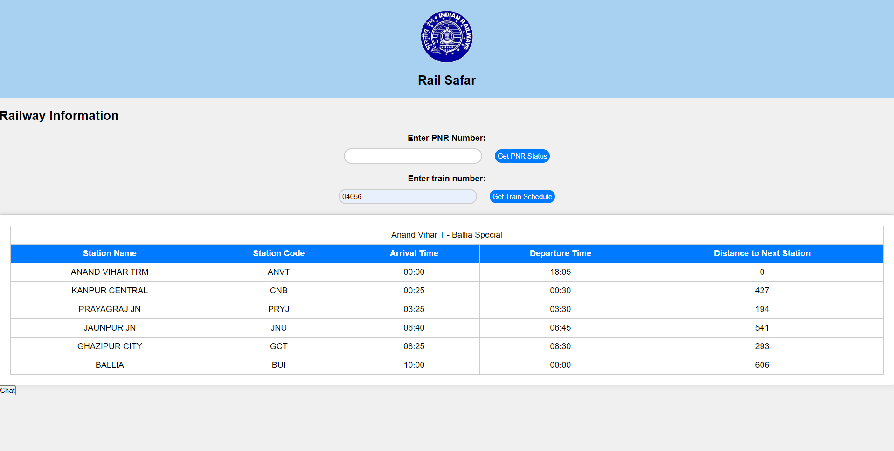

# Real Time Railway Assistant

## 🔍 Overview
This project enhances the railway inquiry experience by providing answers in any preferred language using an AI-powered chatbot. It integrates machine learning and natural language processing for real-time station announcements and multilingual support.

## 📸 Screenshots

### User Interface

### Homepage

## 💡 Idea/Approach Details
- **🖥️ Web Interface and Mobile Application:** Extends from a web interface to a mobile application, providing answers to user queries in preferred languages (Indian regional or foreign languages).
- **🔊 Multilingual Station Announcements:** Utilizes natural language processing to make station announcements in multiple languages.
- **📢 Automatic Live Station Data Announcements:** Machine learning models announce live station data in various languages.
- **🤖 Multilingual AI Chatbot:** An AI-powered chatbot supports multilingual queries, allowing users to inquire about train schedules, PNR status, emergency alerts, etc., through text or voice inputs.
- **🎙️ Noise Reduction in Speech Recognition:** Machine learning algorithms using frameworks like PyTorch reduce noise during speech recognition in noisy environments.
- **🗂️ User Interface:** Users can access information about train schedules, routes, and PNR status directly through the user interface.

## 🛠️ Tech Stack
- **💻 Frontend:** HTML, CSS, JavaScript, React
- **🔧 Backend:** Django framework, Rest API
- **🗄️ Database:** PostgreSQL, MongoDB
- **🗣️ Speech Recognition:** Google speech-to-text & text-to-speech

## 📦 Dependencies
- **🗣️ Voice Recognition:** Google speech-to-text & text-to-speech for generating speech in various languages.
- **⏰ Real-Time Data:** IRCTC API for real-time data, such as train schedules and platform changes.
- **🧠 Natural Language Processing:** NLP models like NLTK for processing language inputs.
- **🌐 Network Connectivity:** Requires network connectivity for real-time data access.

## 📄 License
This project is licensed under the [MIT License](LICENSE).
